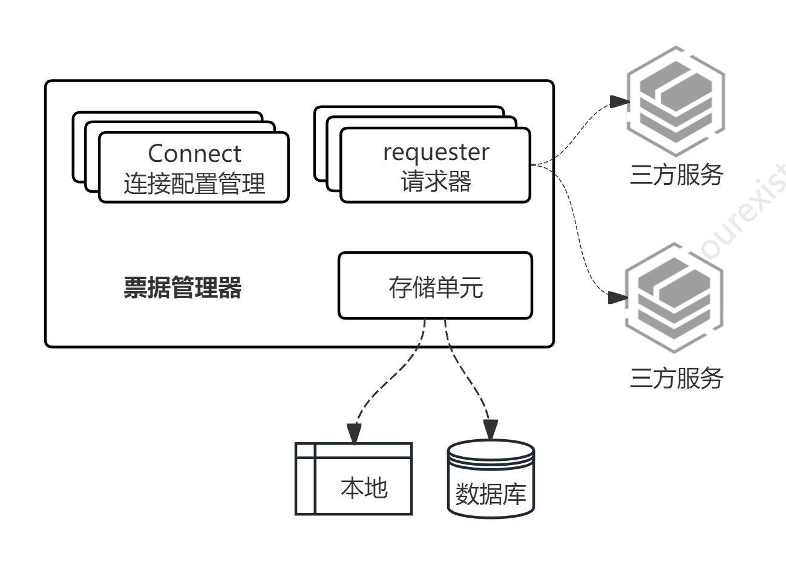
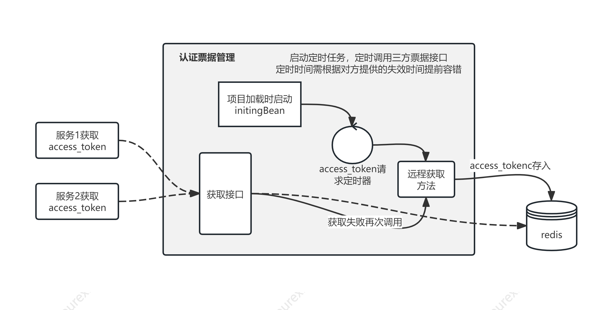

# 1.1.0
## 使用规则
1. 直接依赖,配置自动注入
2. 实现请求器[RemoteTokenRequester.java](src/main/java/com/ourexists/era/framework/tms/core/requester/RemoteTokenRequester.java),框架会根据请求器关联的连接名寻址执行
3. 连接信息[Connection.java](src/main/java/com/ourexists/era/framework/tms/core/requester/Connection.java)中的`name`需要保证唯一性
4. 使用管理器对所有的票据管理[EraThirdAccessTokenManger.java](src/main/java/com/ourexists/era/framework/tms/core/manager/EraThirdAccessTokenManger.java),该管理器实现了对所有的票据管理

注意：
1. 默认使用内存管理方式进行的票据管理,不适用分布式情形。如需使用分布式管理机制请使用[era-framework-tms-redission](../era-framework-tms-redission)

框架模型

场景思路
